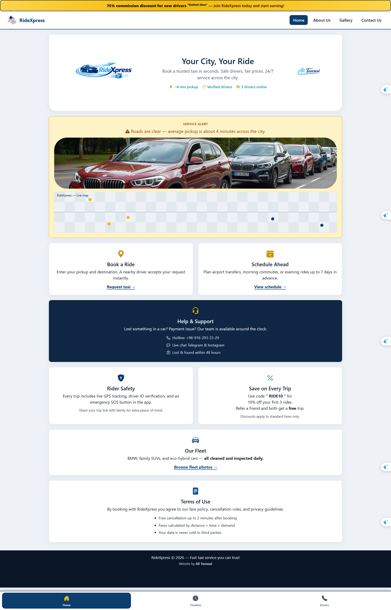
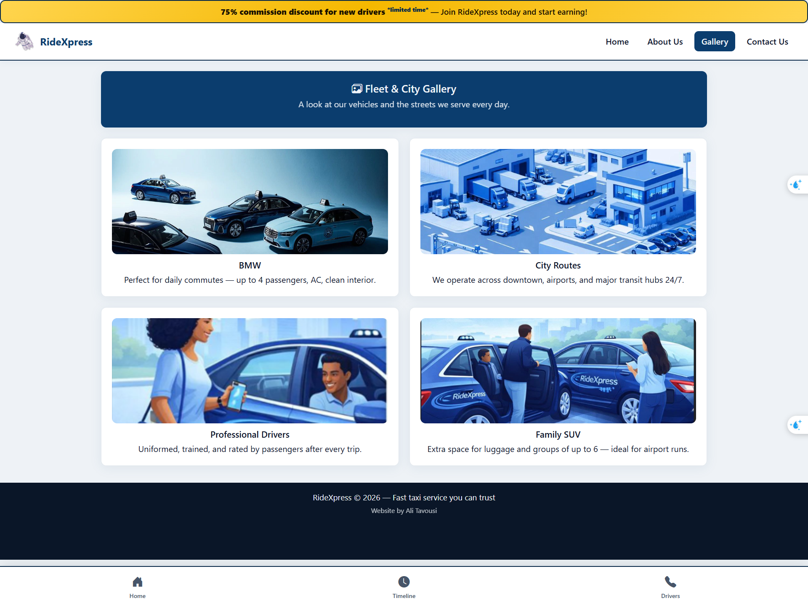
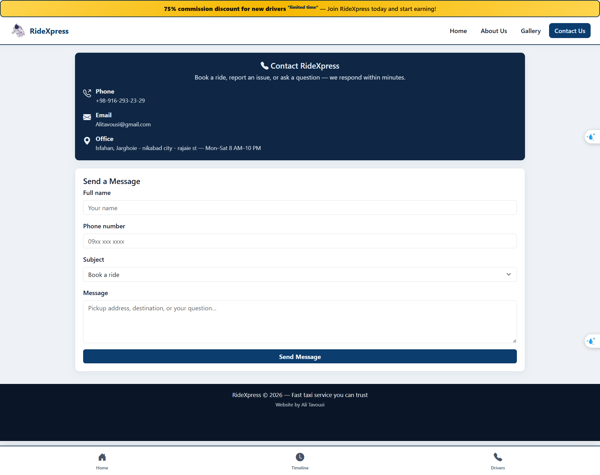
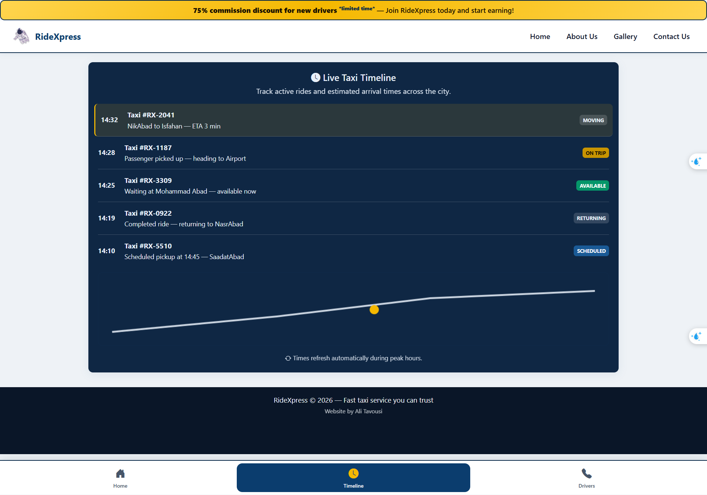
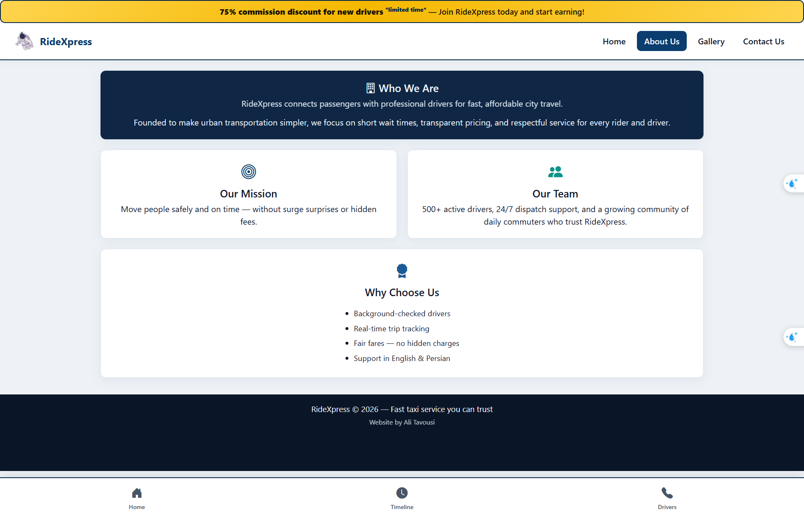
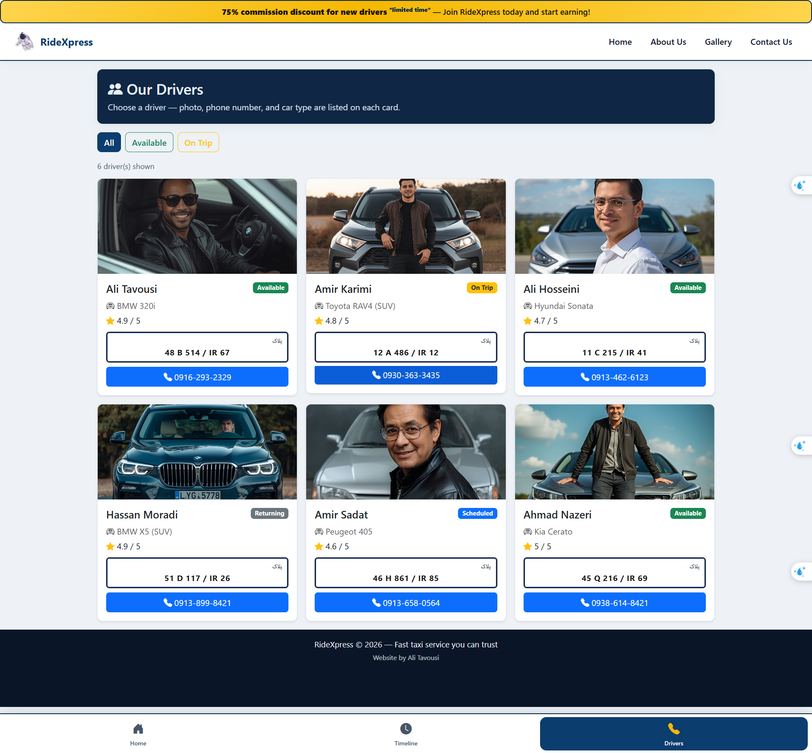

## 🔗 Live Demo

[View Website](https://alitavousi83.github.io/RideXpress/)

# 🚖 RideXpress

A modern, responsive taxi service website developed using HTML5, CSS3, Bootstrap 5, Bootstrap Icons, and JavaScript.

The project demonstrates responsive web design principles, CSS Grid layouts, Flexbox alignment techniques, reusable design tokens, modern UI/UX practices, and interactive JavaScript programming concepts.

---

## 🌟 Project Overview

RideXpress is a fictional taxi booking platform designed to provide users with a fast, safe, and reliable transportation experience.

The website includes:

* Responsive navigation system
* Promotional banner
* Service announcements
* Taxi booking shortcuts
* Customer support information
* Safety information
* Fleet showcase
* Contact page
* Gallery page
* Timeline page
* Interactive JavaScript features
* Dynamic user interface updates
* Canvas-based graphics and animations

---

## 🎯 Project Objectives

The main goals of this project are:

* Practice HTML5 semantic structure
* Implement responsive layouts
* Learn CSS Grid and Flexbox
* Use Bootstrap components effectively
* Create a clean and user-friendly interface
* Apply color psychology principles
* Practice JavaScript programming fundamentals
* Work with DOM manipulation
* Build interactive user experiences
* Learn HTML5 Canvas drawing techniques

---

## 🛠 Technologies Used

| Technology           | Purpose                     |
| -------------------- | --------------------------- |
| 🌐 HTML5             | Structure                   |
| 🎨 CSS3              | Styling                     |
| 🅱 Bootstrap 5.3.3   | Responsive Framework        |
| 🎯 Bootstrap Icons   | Icons                       |
| 📱 Responsive Design | Mobile Compatibility        |
| ⚡ JavaScript (ES6+) | Interactivity & Logic       |
| 🎨 HTML5 Canvas      | Graphics & Drawing          |

---

## 📂 Project Structure

```text
RideXpress/
│
├── .gitignore
├── aboutUs.html
├── contact.css
├── contact.html
├── contanctUs.html
├── gallery.html
├── index.css
├── index.html
├── timeline.html
│
├── js/
│   └── main.js
│
├── pic/
│   ├── logo.png
│   ├── city.jpg
│   └── ...
│
└── screenshots/
    ├── home.png
    ├── gallery.png
    └── contact.png
```

---

## 🎨 Design System

The website uses a custom design token system.

### Color Psychology

| Color        | Purpose                |
| ------------ | ---------------------- |
| 🔵 Navy Blue | Trust & Reliability    |
| 🟡 Taxi Gold | Energy & Visibility    |
| 🟢 Teal      | Modern Mobility        |
| ⚪ White      | Simplicity & Clarity   |
| 🟠 Amber     | Traffic Alerts         |
| 🟢 Green     | Success & Availability |

---

## 📐 Layout Techniques

### CSS Grid

Used for:

* Main page layout
* Content organization
* Responsive section positioning

Example:

```css
grid-template-areas:
    "top"
    "news"
    "shortcut1"
    "shortcut2";
```

### Flexbox

Used for:

* Hero section alignment
* Navigation alignment
* Footer organization
* Timeline components

Example:

```css
display: flex;
justify-content: center;
align-items: center;
```

---

## 💻 JavaScript Features

The project has been enhanced with JavaScript to create a more dynamic and interactive user experience.

### Variables

The application uses JavaScript variables (`let`, `const`) to store and manage application data efficiently.

### Conditional Statements

Conditional logic is implemented using:

* `if`
* `else`
* `else if`
* `switch`

to control application behavior based on user interactions.

### Loops

Different loop structures are used, including:

* `for`
* `while`
* `do...while`
* `for...of`

to process collections of data efficiently.

### Pattern Generation

JavaScript loops are used to generate different programming patterns, helping demonstrate algorithmic thinking and loop logic.

### DOM Manipulation

The project uses the Document Object Model (DOM) to:

* Select HTML elements
* Modify page content dynamically
* Change styles
* Add and remove elements
* Handle user interactions
* Update the interface without reloading the page

### Canvas

HTML5 Canvas is used for graphical rendering, allowing JavaScript to draw shapes, lines, text, and interactive visual elements directly in the browser.

---

## 📱 Responsive Design

The project follows a Mobile-First approach.

### Breakpoints

| Screen Size | Layout       |
| ----------- | ------------ |
| <576px      | Mobile       |
| ≥576px      | Tablet       |
| ≥768px      | Large Tablet |
| ≥992px      | Desktop      |

Media Queries are used to adapt layouts for different devices.

---

## ✨ Main Features

### 🚕 Ride Booking

Users can quickly access ride booking services.

### 📅 Schedule Ahead

Allows ride scheduling for future dates.

### 🛡 Rider Safety

Includes information about:

* Driver verification
* GPS tracking
* Emergency support

### 🎧 Customer Support

24/7 support information is provided.

### 🚘 Fleet Showcase

Displays available vehicle categories.

### ⚡ Interactive JavaScript

* Dynamic DOM updates
* Interactive buttons
* Conditional rendering
* Loop-based content generation
* Canvas drawing
* Real-time user interaction

---

## 🧠 JavaScript Concepts Demonstrated

This project demonstrates practical use of the following JavaScript concepts:

* Variables (`let`, `const`)
* Expressions
* Operators
* Conditional Statements
* Loops
* Pattern Generation
* Functions
* DOM Manipulation
* Event Handling
* HTML5 Canvas API

---

## 📸 Screenshots

### Home Page



### Gallery Page



### Contact Page



### timeline Page



### aboutUs Page



### Drivers Page



---

## 🚀 Future Improvements

* Online booking form
* Backend integration
* User authentication
* Driver dashboard
* Real-time location tracking
* Payment gateway integration
* Advanced JavaScript animations
* API integration
* Local Storage support
* Dark mode

---

## 👨‍💻 Author

Ali Tavousi

Frontend Developer Student

---

## 📚 Educational Purpose

This project was developed as a university web design assignment to demonstrate practical frontend development skills using HTML, CSS, Bootstrap, Grid Layouts, Responsive Design, JavaScript fundamentals, DOM manipulation, and HTML5 Canvas.